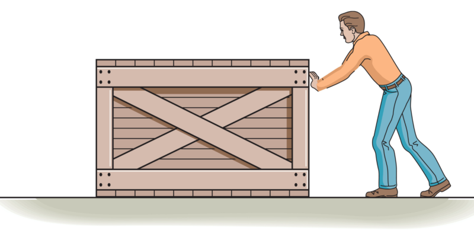
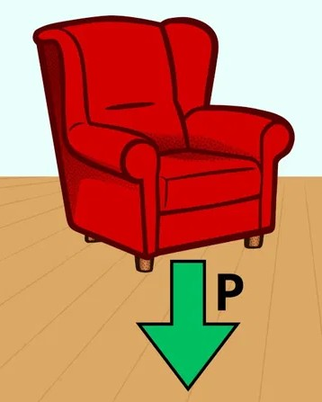
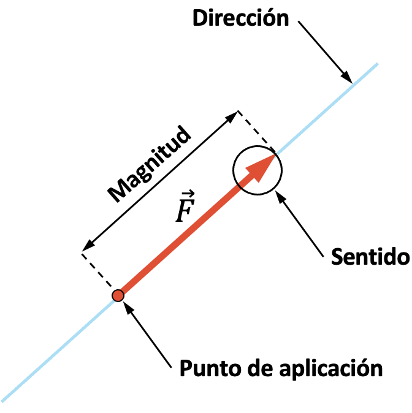
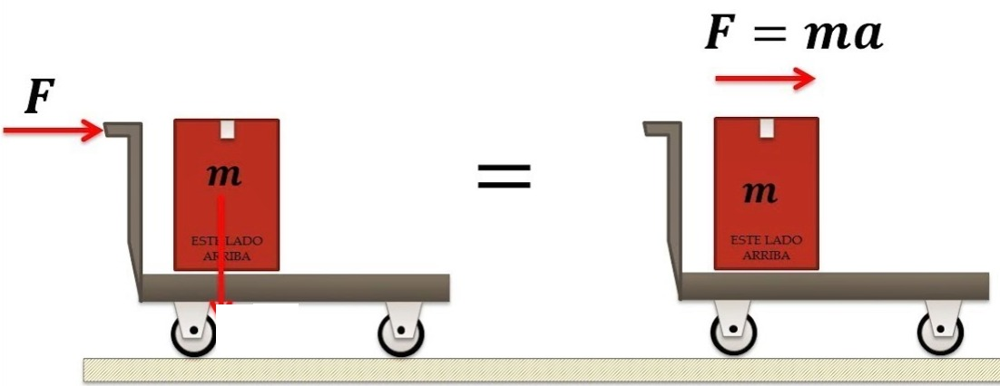
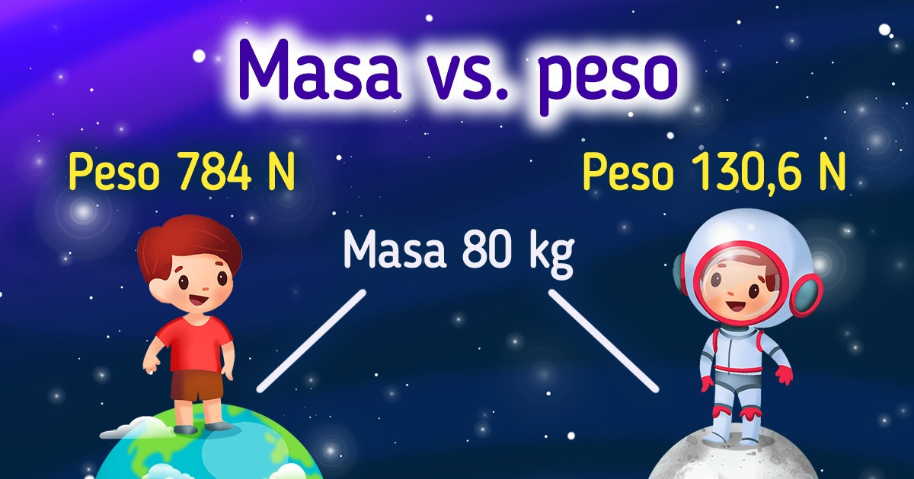

# 1. CONCEPTO DE FUERZA

A pesar de haber hablado de la fuerza en temas anteriores, conviene volver a repasar y profundizar un poco más en el concepto de **fuerza**.

{ align=right width=25% }

!!! note "Fuerza"
    Una **fuerza** es todo aquello capaz de deformar un cuerpo o de alterar su estado de reposo o movimiento.

Ejemplos son la fuerza del viento, las fuerzas que genera un motor, las que desarrollan nuestros músculos. También lo es el **peso** de un objeto. { align=right width=15% }

!!! note "Peso"
    Es la **fuerza** con la que es atraído cualquier objeto debido a la gravedad que actúa sobre la masa (cantidad de materia) de un objeto.

{ align=right width=25% }

Para definir perfectamente una fuerza es necesario especificar:

* su **dirección:** el ángulo que forma con respecto al punto donde se ejerce la fuerza,

* su **sentido:** hacia donde se ejerce la fuerza,

* su **magnitud (o modulo):** es decir, su intensidad.

!!! note "Magnitud de una Fuerza"
    La magnitud o intensidad de una Fuerza es igual al producto de la masa del objeto por la aceleración (cambio en la velocidad).

    { align=right width=30% }

    $$F = m \cdot a $$

    $$donde \begin{cases}
        F \text{ es la } Fuerza \text{ en } Newton\enspace (N)\\
        m \text{ es la } masa \text{ en } kilogramos\enspace (kg)\\
        a \text{ es la } aceleración \text{ en } metros/segundo^2 \enspace (\dfrac{m}{s^2})\\
    \end{cases}$$

    La unidad en el Sistema Internacional de medidas es el $Newton (N)$.

Por ejemplo, para la fuerza de la gravedad (**Peso**), la dirección será la línea que une el objeto con el centro de la Tierra, su sentido hacia el centro de la tierra, y su intensidad viene dada por la Ley de Newton.  **El Peso es una Fuerza**.

$$P=F=m \cdot g$$

$$donde \begin{cases}
    P \text{ es el } Peso \text{ en } Newton\enspace (N)\\
    m \text{ es la } masa \text{ en } kilogramos\enspace (kg)\\
    g \text{ es la } aceleración\enspace de\enspace la\enspace gravedad \text{ en } metros/segundo^2 \enspace (\dfrac{m}{s^2})\\
\end{cases}$$

La aceleración de la gravedad **g** la aceleración de la gravedad, que en la **superficie terrestre** es aproximadamente $9,81\thickspace \dfrac{m}{s^2}$.

## 1.1 DIFERENCIA ENTRE PESO Y MASA

**Peso (P) y masa (m)** son dos conceptos y magnitudes físicas bien diferenciadas. Sin embargo, en el habla cotidiana el término peso se utiliza a menudo erróneamente como sinónimo de masa. Así, cuando determinamos la masa de un cuerpo decimos erróneamente que lo pesamos, y que su peso es de tantos kilogramos.

### 1.1.1. Masa (m)

La **masa (m)**  de un cuerpo es una *propiedad intrínseca* (propia del mismo). Es la cantidad de materia que lo compone (independiente del campo gravitatorio) y se calcula sumando la masa de todos los átomos que forman el cuerpo.

{ align=right width=50% }

Por ejemplo, una persona de 80 kg de masa seguirá teniendo 80 kg de masa, independientemente de si se encuentra en la Tierra o si se encuentra en la Luna, ya que es una propiedad intrínseca.

### 1.1.2. Peso (P)

Por otro lado, el **peso (P)** es la *fuerza* con la que se ve atraído un cuerpo por un campo gravitatorio como es, en nuestro caso, la Tierra. Por tanto, el peso de un cuerpo *no es una propiedad intrínseca* del mismo, ya que depende del campo gravitatorio del lugar donde se encuentre.

Así en la superficie terrestre, una persona con una masa de 80 kg tendrá un peso en la Tierra de 784 N, mientras que en la Luna será de 130 N.

**Explicación**:

* Peso en la Tierra: 

$$m=80\thickspace kg $$

$$g_T=9,81\thickspace \dfrac{m}{s^2} $$
    
$$P=m \cdot g_T=80\thickspace kg \cdot 9,81\thickspace \dfrac{m}{s^2}=784\thickspace N$$

* Peso en la Luna:

$$m=80\thickspace kg $$

$$g_L=1,62\thickspace \dfrac{m}{s^2} $$

$$P=m \cdot g_L=80\thickspace kg \cdot 1,62\thickspace \dfrac{m}{s^2}=130\thickspace N$$

A continuación se muestra un video explicativo:

<iframe width="560" height="315" src="https://www.youtube.com/embed/J8pumn0d56A?si=B8j-B7MUqQqVqf1T" title="YouTube video player" frameborder="0" allow="accelerometer; autoplay; clipboard-write; encrypted-media; gyroscope; picture-in-picture; web-share" referrerpolicy="strict-origin-when-cross-origin" allowfullscreen></iframe>