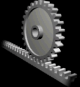
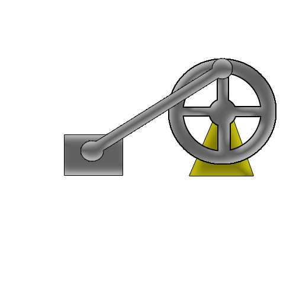

# 3. MOVIMIENTOS {#movimientos}

Antes de empezar a estudiar los mecanismos más en profundidad, es conveniente conocer los **tipos de movimiento** que un mecanismo puede realizar: 

{ align=right width=12% }

* **Lineal**: La trayectoria del movimiento tiene forma de línea recta.

    * Por ejemplo, el subir y bajar un peso con una polea, el movimiento de una puerta corredera…

{ align=right width=15% }

* **Lineal Alternativo**: La trayectoria del movimiento tiene forma de línea recta pero es un movimiento de ida y vuelta.

    * Por ejemplo, el movimiento de la hoja de una sierra de calar.

{ align=right width=15% }

* **Circular**: La trayectoria del movimiento tiene forma de circunferencia. 

    * Por ejemplo, el movimiento de una rueda o el movimiento de la broca de una taladradora.