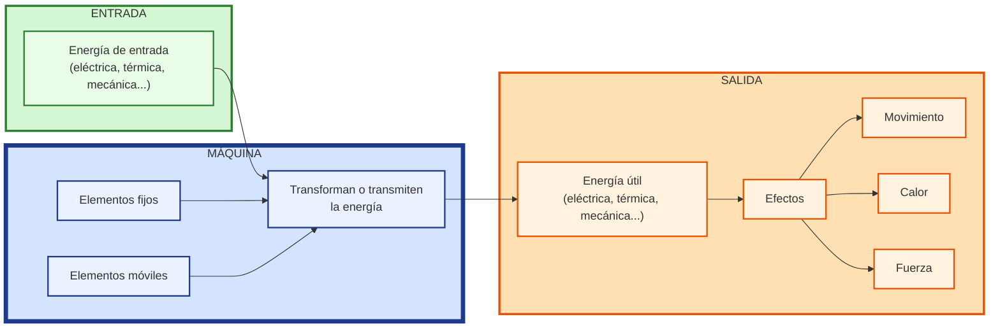
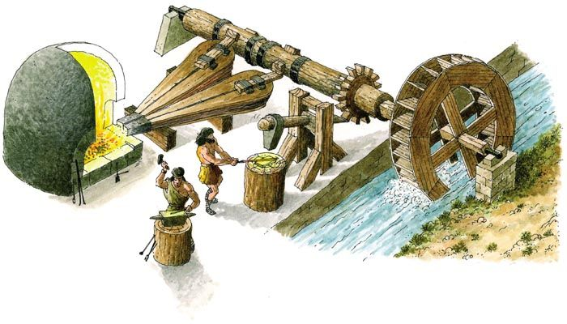
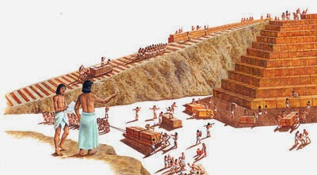
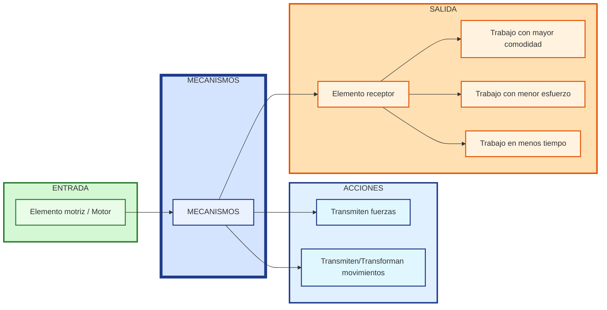

# 3. MÁQUINAS Y MECANISMOS {#máquinas-y-mecanismos}

## 3.1. Máquinas {#máquinas}

El ser humano a lo largo de la historia ha inventado una serie de dispositivos o artilugios llamados **máquinas** que le facilitan y, en muchos casos, posibilitan la realización de una tarea.

!!! note "Máquina"
    
    Una **máquina** es el conjunto de elementos fijos y/o móviles conectados entre sí que transforman/transmiten una forma de energía en otra más útil, realizando algún efecto (movimiento, calentamiento, ...).

{ align=right width=40% }

En la figura, se observa una antigua **fragua hidráulica**. La fuerza del agua movía el martillo, facilitando la labor para elaborar todo tipo de herramientas.

Prácticamente cualquier objeto puede llegar a convertirse en una máquina, sólo hay que darle la utilidad adecuada.  Por ejemplo, una **cuesta** o **plano inclinado**  no es, en principio, una máquina, { align=right width=40% } pero se convierte en ella cuando el ser humano la usa para elevar objetos con un menor esfuerzo (es más fácil subir objetos por una cuesta que elevarlos a pulso). Lo mismo sucede con un simple palo que nos encontramos tirado en el suelo, si lo usamos para mover algún objeto a modo de palanca ya lo hemos convertido en una máquina

Las máquinas suelen clasificarse atendiendo a su complejidad en máquinas simples y máquinas compuestas:

* **Máquinas simples:** realizan su trabajo en un sólo paso o etapa. Por ejemplo, las tijeras donde sólo debemos juntar nuestros dedos. Básicamente son tres: la palanca, la rueda y el plano inclinado. Muchas de estas máquinas son conocidas desde la antigüedad y han ido evolucionando hasta nuestros días. 

    * En el plano inclinado de la figura, el esfuerzo será tanto menor cuanta más larga sea la rampa. Del plano inclinado se derivan muchas otras máquinas como el hacha, los tornillos, la cuña…).

* **Máquinas complejas:** realizan el trabajo encadenando distintos pasos o etapas. Por ejemplo, un cortauñas realiza su trabajo en dos pasos: una palanca le transmite la fuerza a otra, la cual se encarga de apretar los extremos en forma de cuña.

## 3.2. Mecanismos {#mecanismos}

Mientras que las **estructuras** (partes fijas) de las máquinas soportan fuerzas de un modo estático (es decir, sin moverse), los **mecanismos** (partes móviles) permiten el movimiento de los objetos.

!!! note "Mecanismos"
    Los **mecanismos** son los elementos de una máquina destinados a transmitir y transformar las fuerzas y movimientos desde un elemento **motriz** (o motor) a un elemento **receptor**; permitiendo al ser humano realizar trabajos con mayor comodidad y/o, menor esfuerzo (o en menor tiempo).

En todo mecanismo resulta indispensable un **elemento motriz** que origine el movimiento (que puede ser un muelle, una corriente de agua, nuestros músculos, un motor eléctrico…).

El movimiento originado por el motor se transforma y/o transmite a través de los mecanismos a los **elementos receptores** (ruedas, brazos mecánicos...) realizando el trabajo para el que fueron construidos.