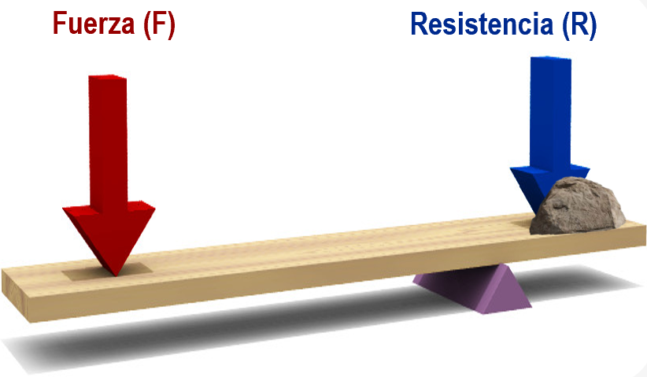
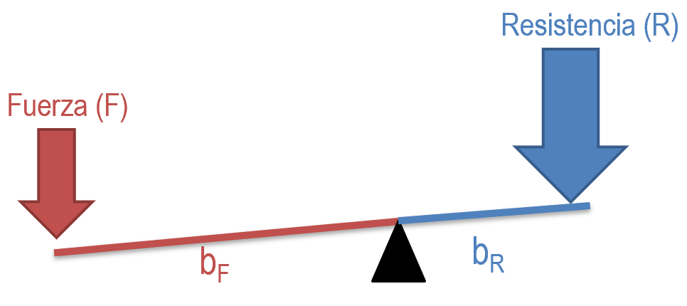
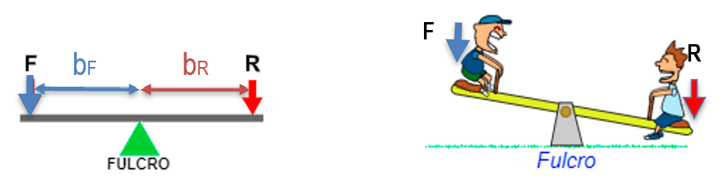
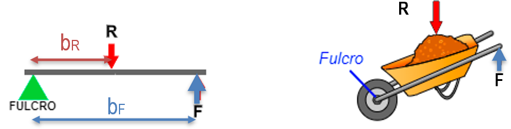
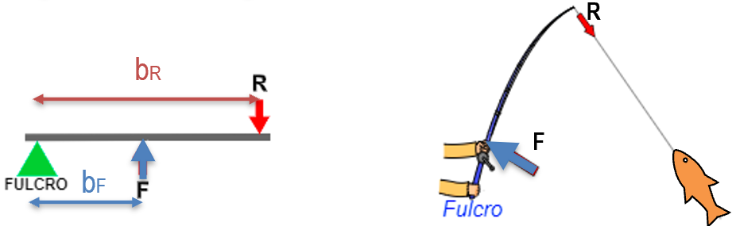

# 5. PALANCAS {#palancas}

Las **palancas** son objetos rígidos que giran entorno un punto de apoyo o **fulcro (O)**. En un punto de la barra se aplica una potencia o **fuerza (F)** con el fin de vencer una **resistencia (R)**. Al realizar un movimiento lineal de bajada en un extremo de la palanca, el otro extremo experimenta un movimiento lineal de subida. Por tanto, la palanca nos sirve para **transmitir** fuerza o movimiento lineal. 

{ align=right width=40% }

La palanca se encuentra en equilibrio cuando el producto de la fuerza (F), por su distancia al punto de apoyo (d) es igual al producto de la resistencia (R) por su distancia al punto de apoyo (r). Esta es la denominada **Ley de la palanca**, que matemáticamente se expresa como:

$$F \cdot b_F= R \cdot b_R $$

donde:

* **F :** **Fuerza** o potencia. Se expresa en Newton (N).

{ align=right width=30% }

* **b~F~** : **Brazo de la fuerza**, es la distancia desde el punto donde se ejerce la fuerza al punto de apoyo (fulcro). Se expresa en metros (m).

* **R** : **Resistencia**. Se expresa en Newton (N).

* **b~R~** : **Brazo de la resistencia**, es la distancia desde el punto donde se encuentra la resistencia a vencer al punto de apoyo (fulcro). Se expresa en metros (m)

Hay tres tipos (géneros o grados) de palanca según se sitúen la fuerza, la resistencia y el punto de apoyo:

* 1º Grado (o género).

* 2º Grado (o género).

* 3º Grado (o género).

## 5.1 Tipos de palancas

### 1º grado o género

!!! note "1º grado"
    **El punto de apoyo (O) se encuentra entre la fuerza aplicada (F) y la resistencia (R).** 

{ align=left width=90% }

Dependiendo de la colocación del punto de apoyo:

* la fuerza a aplicar puede ser menor (si $b_F>b_R$), 

* la fuerza a aplicar es mayor (si $b_F<b_R$),

* la fuerza a aplicar es igual (si $b_F=b_R$) que la resistencia.

**Ejemplos:** Balancín, balanza, tijeras, alicate, martillo (al sacar un clavo), remo de una barca, pinzas de colgar ropa….

### 2º grado o género {#segundo-grado-o-género}

!!!note " 2º grado"
    **La resistencia (R) se encuentra entre la fuerza aplicada (F) y el punto de apoyo (O).**

{ align=left width=97% }

La fuerza a aplicar siempre es menor que la resistencia, ya que $bf>br$.

Se dice que tiene **Ventaja Mecánica** (VM).

**Ejemplos:** Carretilla, cascanueces, fuelle, abridor de botellas...

### 3º grado o género {#tercer-grado-o-género}

!!!note 3º grado
    **La fuerza a aplicar (F) se encuentra entre la resistencia a vencer (R) y el punto de apoyo (O).**

{ align=left width=97% }

La fuerza a aplicar es siempre mayor que la resistencia, ya que $bf<br$.

Se dice que no tiene **Ventaja Mecánica** (VM).

Ejemplos: caña de pescar, pinzas de depilar, pinzas de hielo, escoba (al barrer), remo de una canoa, banderas, palas de arena..