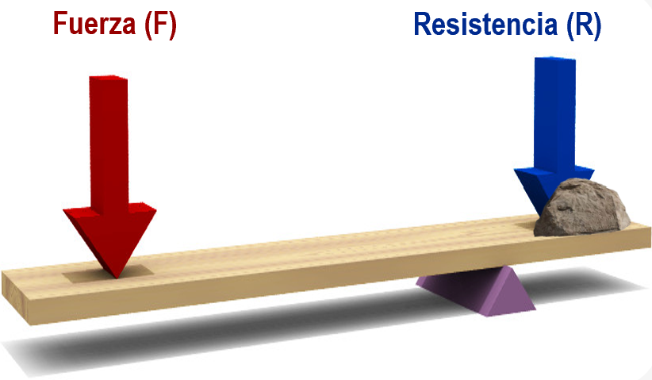
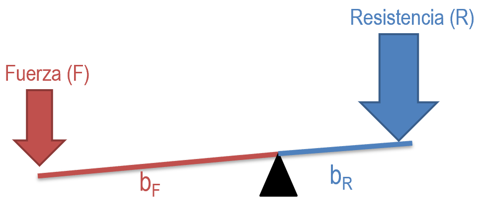
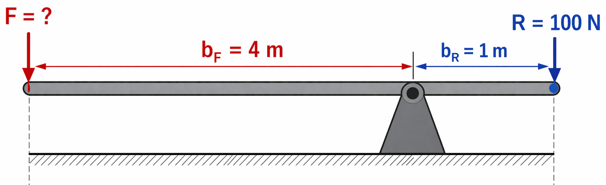
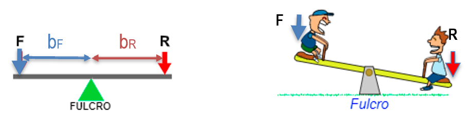
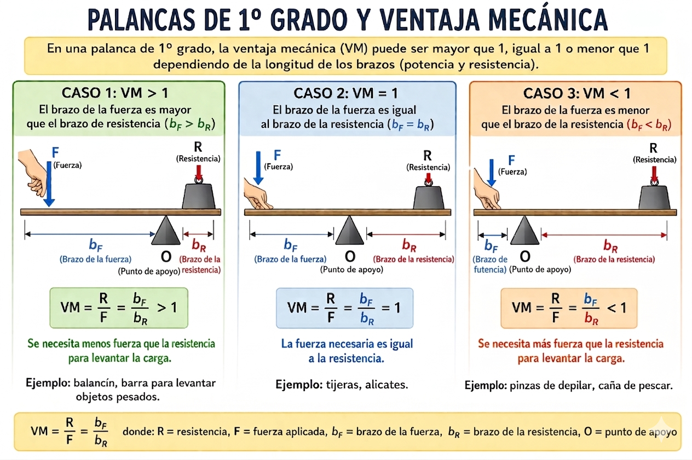
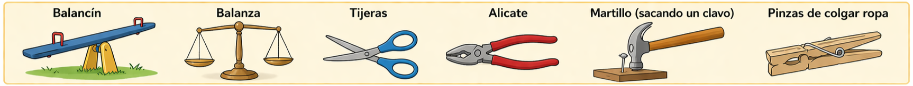
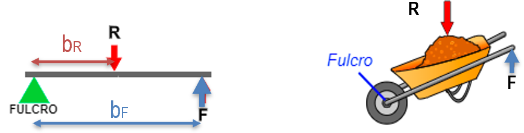
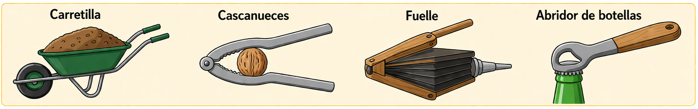
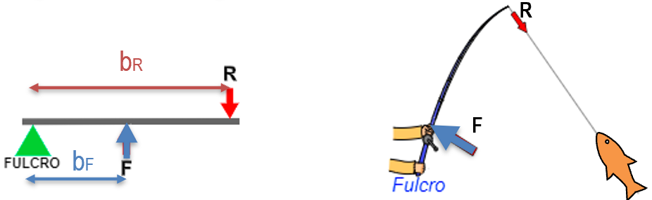
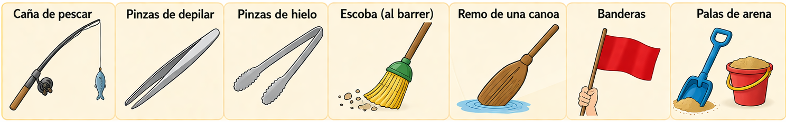

# 7.1. PALANCAS {#palancas}

Las **palancas** son objetos rígidos que giran entorno un punto de apoyo o **fulcro (O)**. En un punto de la barra se aplica una potencia o **fuerza (F)** con el fin de vencer una **resistencia (R)**. Al realizar un movimiento lineal de bajada en un extremo de la palanca, el otro extremo experimenta un movimiento lineal de subida. Por tanto, la palanca nos sirve para **transmitir** fuerza o movimiento lineal. 

## 7.1.1. Ley de la Palanca

{ align=right width=40% }

La palanca se encuentra en equilibrio cuando el producto de la fuerza (F), por su distancia al punto de apoyo (d) es igual al producto de la resistencia (R) por su distancia al punto de apoyo (r). Esta es la denominada **Ley de la palanca**, que matemáticamente se expresa como: (1)

\begin{equation}
{\huge \textcolor{darkred}{F \cdot b_F} = \textcolor{darkblue}{R \cdot b_R}}
\end{equation}

donde:

* **F :** **Fuerza**, es la Fuerza **que hay que realizar** para elevar la fuerza de Resistencia. Se expresa en Newton (N).

{ align=right width=30% }

* **b~F~** : **Brazo de la fuerza**, es la distancia desde el punto donde se ejerce la fuerza al punto de apoyo (fulcro). Se expresa en metros (m).

* **R** : **Resistencia**, es la fuerza **que queremos vencer o elevar**. Se expresa en Newton (N).

* **b~R~** : **Brazo de la resistencia**, es la distancia desde el punto donde se encuentra la resistencia a vencer al punto de apoyo (fulcro). Se expresa en metros (m)

En el caso de que necesites **calcular (despejar) la $F$** necesaria para elevar una $R$ dada: (2)

\begin{equation}
\large 
\textcolor{darkred}{F} = \frac{\textcolor{darkblue}{R} \cdot \textcolor{darkblue}{b_R}}{\textcolor{darkred}{b_F}}
\end{equation}

### Ejemplo

Supongamos una palanca con las siguientes características:

{ align=right width=50% }

- Carga o Resistencia: \(R = 100 \, \text{N}\)  
- Brazo de resistencia: \(b_R = 1 \, \text{m}\)  
- Brazo de fuerza: \(b_F = 4 \, \text{m}\)  

La Fuerza aplicada necesaria sería:

\[
\textcolor{darkred}{F} = \frac{\textcolor{darkblue}{R} \cdot \textcolor{darkblue}{b_R}}{\textcolor{darkred}{b_F}} 
= \frac{100 \, \text{N} \cdot 1 \, \text{m}}{4 \, \text{m}} 
= 25 \, \text{N}
\]

✅ Gracias a la palanca, aplicando **solo 25 N** podemos levantar una carga de **100 N**.  

---

> Tip: Cuanto **más largo sea el brazo de fuerza \(b_F\)** en comparación con el brazo de resistencia \(b_R\), **menos esfuerzo necesitaremos** para mover la carga.

## 7.1.2. Ventaja Mecánica (VM)

Las **palancas** son máquinas simples que nos permiten **multiplicar la fuerza** que aplicamos para mover una carga. 

!!! note "Definición de VM"
    La **ventaja mecánica (VM)** de una palanca es la relación entre la **Resistencia** que queremos elevar y la **Fuerza** que se aplica.
       
    \[
    \text{VM} = \frac{\color{darkblue}{R}}{\color{darkred}{F}}
    \]  

    Nos dice cuántas veces es más grande (o pequeña) $R$ con respecto a $F$.

### Procedimiento para su cálculo:

Partiendo de la Ley de la Palanca, colocamos las dos fuerzas (F y R) a un lado de la igualdad, mientras que las dos distancias o brazos (bF y bR) al otro lado. Hay que respetar las normas matemáticas, a la hora de mover las magnitudes.

\[
\color{darkred}{F} \cdot \color{darkred}{b_F} = \color{darkblue}{R} \cdot \color{darkblue}{b_R}
\]

Partiendo de esta ley, podemos separar las fuerzas y los brazos respetando las normas matemáticas:

\[
\frac{\textcolor{darkred}{b_F}}{\textcolor{darkblue}{b_R}} = \frac{\textcolor{darkblue}{R}}{\textcolor{darkred}{F}}
\]

A cualquiera de estas igualdades se le conoce como Ventaja Mecánica (VM):

\[
\text{VM} = \frac{\textcolor{darkblue}{R}}{\textcolor{darkred}{F}} = \frac{\textcolor{darkred}{b_F}}{\textcolor{darkblue}{b_R}}
\]

Podemos calcular la VM de dos maneras:

\[
\text{VM} = \frac{\color{darkblue}{R}}{\color{darkred}{F}}
\quad\quad
\text{VM} = \frac{\color{darkred}{b_F}}{\color{darkblue}{b_R}}
\]

**Interpretación:**

- VM > 1 → la palanca **multiplica la fuerza**, menos esfuerzo para mover la carga.  
- VM = 1 → solo cambia la dirección de la fuerza.  
- VM < 1 → se necesita **más fuerza** para elevar cierta resistencia.  

## 7.1.3. Tipos de palancas

Hay tres tipos (géneros o grados) de palanca según se sitúen la fuerza, la resistencia y el punto de apoyo:

* 1º Grado (o género).

* 2º Grado (o género).

* 3º Grado (o género).

## - 1º grado o género

!!! note "Palancas de 1º grado"
    **El fulcro (O) se encuentra entre la fuerza aplicada (F) y la resistencia (R).** 

{ align=left width=100% }

> Las palancas de 1º grado son las únicas en las que la VM puede tomar los tres valores respecto al 1:

{ align=right width=100% }

| **Situación (1º Grado)** | **Ventaja Mecánica (VM)** | **Relación de Brazos** | **Fuerza a aplicar ($F$)** | **Ejemplo típico** |
| :--- | :--- | :--- | :--- | :--- |
| **O cerca de la Carga** | **Mayor que 1** (VM > 1) | $b_F > b_R$ (Brazo fuerza largo) | **Menor** que la resistencia ($R$) | Sacar un clavo, balancín |
| **O en el centro** | **Igual a 1** (VM = 1) | $b_F = b_R$ (Brazos iguales) | **Igual** a la resistencia ($R$) | Balanza de platillos |
| **O cerca de la Fuerza** | **Menor que 1** (VM < 1) | $b_F < b_R$ (Brazo fuerza corto) | **Mayor** que la resistencia ($R$) | Tijeras de papel largas |

**Ejemplos:** Balancín, balanza, tijeras, alicate, martillo (al sacar un clavo), pinzas de colgar ropa….

{ align=left width=100% }

---

## - 2º grado o género {#segundo-grado-o-género}

!!!note "Palancas de 2º grado"
    **La resistencia (R) se encuentra entre la fuerza aplicada (F) y el fulcro (O).**

{ align=right width=100% }

**¡Importante!:** En las palancas de 2º grado SIEMPRE se cumple:

| **Tipo de Palanca** | **Ventaja Mecánica (VM)** | **Relación de Brazos** | **Fuerza a aplicar ($F$)** | **Esfuerzo necesario** |
| :--- | :--- | :--- | :--- | :--- |
| **2º Grado** | **Siempre mayor que 1** (VM > 1).   Tiene **Ventaja Mecánica**. | El brazo de fuerza ($b_F$) es **siempre mayor** que el brazo de resistencia ($b_R$) | **Siempre menor** que la resistencia ($R$) a vencer | **Menor** fuerza para mover la carga |

**Ejemplos:** Carretilla, cascanueces, fuelle, abridor de botellas...
{ align=left width=100% }

***

## -  3º grado o género {#tercer-grado-o-género}

!!!note "Palancas de 3º grado"
    **La fuerza a aplicar (F) se encuentra entre la resistencia a vencer (R) y el fulcro (O).**

{ align=left width=100% }

**¡Importante!:** En las palancas de 3º grado SIEMPRE se cumple:

| **Tipo de Palanca** | **Ventaja Mecánica (VM)** | **Relación de Brazos** | **Fuerza a aplicar ($F$)** | **Esfuerzo necesario** |
| :--- | :--- | :--- | :--- | :--- |
| **3º Grado** | **Siempre menor que 1** (VM < 1).   Se dice que no tiene **Ventaja Mecánica** (VM) | El brazo de fuerza ($b_F$) es **siempre menor** que el brazo de resistencia ($b_R$) | **Siempre mayor** que la resistencia ($R$) a vencer | **Mayor** fuerza para mover la carga |

**Ejemplos**: caña de pescar, pinzas de depilar, pinzas de hielo, escoba (al barrer), remo de una canoa, banderas, palas de arena..

{ align=left width=100% }
