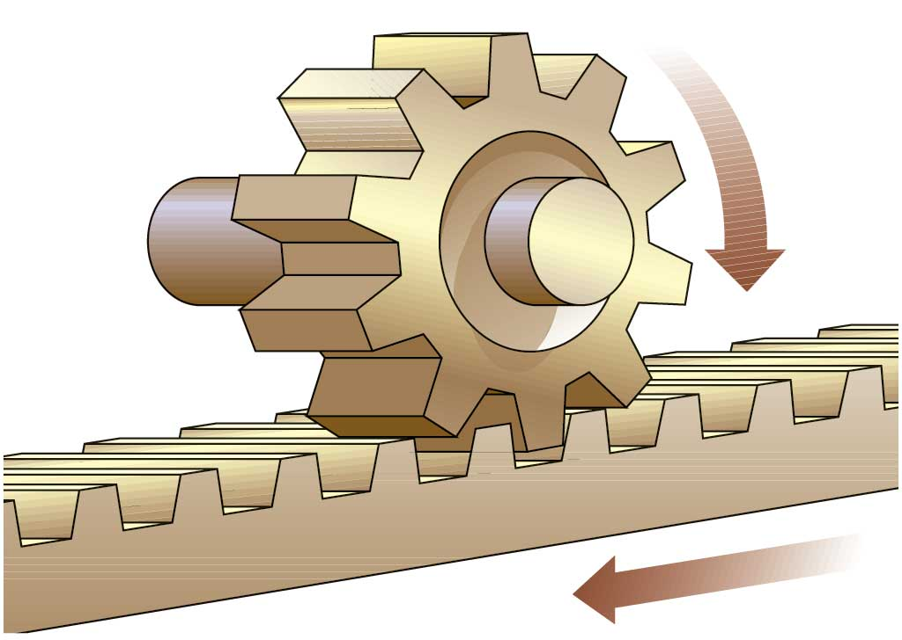
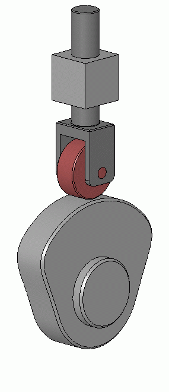
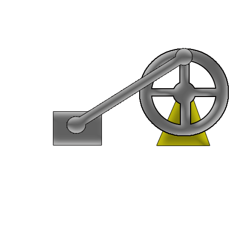

# 9. CLASIFICACIÓN: MECANISMOS DE TRANSFORMACIÓN DEL MOVIMIENTO {#mecanismos-de-transformación-del-movimiento}

Los **mecanismos de transformación del movimiento** son aquellos que **cambian** (transforman) el tipo de movimiento:

* de lineal a circular (o a la inversa),
* de circular a lineal alternativo (o a la inversa).

-   **Movimiento LINEAL a CIRCULAR**

    { width=60% }

    *Descripción*: Un **piñón** (engranaje circular) engrana con una **cremallera** (barra dentada). Al girar el piñón, la cremallera se desplaza en línea recta (o viceversa).  

    *Aplicaciones*:  
      - Dirección asistida en automóviles.  
      - Impresoras 3D (movimiento del cabezal).  
      - Puertas automáticas y sistemas de posicionamiento CNC.
      
    *Ventajas*:  
      - Alta precisión en el desplazamiento lineal.  
      - Reversibilidad (puede convertir lineal a circular). 

-   **Movimiento CIRCULAR a LINEAL ALTERNATIVO**
    
    { width=30% }

    *Descripción*: La **leva** (disco excéntrico) gira y su perfil empuja al **seguidor**, generando movimiento lineal intermitente.
    
    *Aplicaciones*: Válvulas en motores, máquinas de coser, sistemas de automatización.  

-   **Movimiento CIRCULAR a LINEAL ALTERNATIVO**
    
    { width=50% }

    *Descripción*: La **manivela** gira (movimiento circular) y la **biela** lo transforma en movimiento rectilíneo alternativo.
    
    *Aplicaciones*: Motores de combustión, bombas de agua, compresores.  

