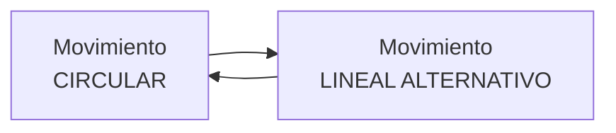

# MECANISMOS DE TRANSFORMACIÓN CIRCULAR/LINEAL ALTERNATIVO {#mecanismos-de-transformación-circular/lineal-alternativo}

Pueden transformar un movimiento circular del conductor a un movimiento lineal alternativo en el conducido; o al revés, de un movimiento lineal alternativo del conductor a un movimiento circular en el conducido.

# Leva y excéntrica {#leva-y-excéntrica}

{ align=right width=30% }

Estos sistemas se componen de una pieza de contorno especial, denominada **leva**, o de una **rueda excéntrica** que tiene un movimiento circular a través del eje motriz y de un elemento conducido, denominado **seguidor**, que está permanentemente en contacto con la leva por la la acción de un muelle.

{ align=left width=10% }

Ambos son mecanismos que permiten convertir un movimiento rotativo en un movimiento lineal; pero no al contrario, por lo que **no es reversible**. De este modo, el giro del eje hace que el contorno de la leva o excéntrica mueva o empuje al seguidor que realizará un recorrido ascendente y descendente (movimiento lineal alternativo).

Este tipo de mecanismos se emplea en cerraduras, carretes de pesca, cortapelos, depiladoras, motores de automóviles, juguetes... etc.

{ align=right width=40% }

Un tipo de leva especial es la **excéntrica**, que consta de una rueda circular que gira sobre un eje que no pasa por su centro geométrico. De este modo se consigue un movimiento del seguidor más suave.

## Biela-Manivela {#biela-manivela}

{ align=right width=40% }

Este mecanismo está formado por una **manivela** que tiene un movimiento circular y una barra llamada **biela.** La **biela** está unida con articulaciones por un extremo a la manivela, y por el otro a un **sistema de guiado** (un pistón o émbolo encerrado en unas guías) que describe un movimiento rectilíneo alternativo en ambos sentidos.

Este mecanismo sirve para transformar un movimiento circular en uno lineal o viceversa, ya que **es reversible**.

{ align=right width=40% }

El funcionamiento del sistema biela-manivela es el siguiente: al girar la rueda, la manivela transmite el movimiento circular a la biela, que experimenta un movimiento de vaivén provocando el movimiento del pistón en ambos sentidos.

Este mecanismo se empleó en la locomotora de vapor, empleándose en motores de combustión interna, herramientas mecánicas, máquinas de coser....

## Cigüeñal {#cigueñal}

{ align=right width=30% }

Se denomina **cigüeñal** al conjunto manivelas asociadas sobre un mismo eje.

La utilidad práctica del cigüeñal es la conversión de un un movimiento rotativo continuo en uno lineal alternativo, o viceversa. Para ello se ayuda de bielas (sistema biela-manivela sobre un *cigüeñal*). { align=left width=40% } Así, en el caso de los motores se colocan una serie de bielas en un mismo eje acodado, donde cada uno de los codos del eje hace las veces de manivela.