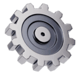

 

{ align=right width=20% }

¡Bienvenidos al curso de **Mecanismos** para **1º ESO** ! En este curso aprenderás cómo funcionan las máquinas y los sistemas que utilizamos en nuestra vida cotidiana, desde los más simples hasta los más complejos. Los mecanismos están en todas partes: en bicicletas, puertas automáticas, relojes, grúas y mucho más. Comprenderlos te ayudará no solo a saber cómo funcionan las cosas, sino también a diseñar e imaginar tus propias creaciones.

## ¿Qué aprenderás en este curso?

A lo largo de este curso, exploraremos los fundamentos de los mecanismos. Algunos de los temas principales que abordaremos incluyen:

- **Máquinas simples**: Aprende cómo trabajan las palancas, poleas, planos inclinados, tornillos, cuñas y ruedas.
- **Transmisión de movimiento**: Descubre cómo funcionan engranajes, correas y cadenas para transmitir energía y movimiento.
- **Transformación de movimiento**: Estudia cómo se transforma el movimiento lineal en circular y viceversa.
- **Aplicaciones prácticas**: Identifica cómo se utilizan los mecanismos en objetos y máquinas de uso cotidiano.

## ¿Por qué es importante aprender sobre mecanismos?

Los mecanismos son fundamentales en el diseño de máquinas y herramientas que hacen nuestra vida más fácil. Al aprender sobre ellos, desarrollarás habilidades para:

- Resolver problemas técnicos.
- Comprender cómo funcionan las herramientas y los dispositivos.
- Desarrollar tu creatividad para inventar y construir.

Además, este conocimiento te abrirá las puertas a áreas como la ingeniería, la robótica y el diseño industrial.

## Metodología del curso

El curso combinará teoría y práctica. Algunas actividades clave serán:

- **Clases teóricas**: Introducción a conceptos básicos con ejemplos del mundo real.
- **Talleres prácticos**: Construcción de modelos de mecanismos simples.
- **Proyectos grupales**: Diseño y construcción de mecanismos creativos para resolver problemas específicos.
- **Evaluaciones divertidas**: Cuestionarios interactivos y desafíos prácticos para demostrar lo aprendido.

## Objetivos del curso

Al final del curso, serás capaz de:

1. Identificar y describir los principales tipos de mecanismos.
2. Explicar cómo se transmiten y convierten los movimientos.
3. Diseñar y construir modelos funcionales de mecanismos simples.
4. Aplicar lo aprendido en situaciones prácticas y reales.

## ¡Comencemos!

Prepárate para sumergirte en el fascinante mundo de los mecanismos. Al final del curso, serás capaz de ver el mundo desde una nueva perspectiva, entendiendo cómo las cosas funcionan y cómo puedes crear tus propios inventos. 

¡Manos a la obra! 🚀
